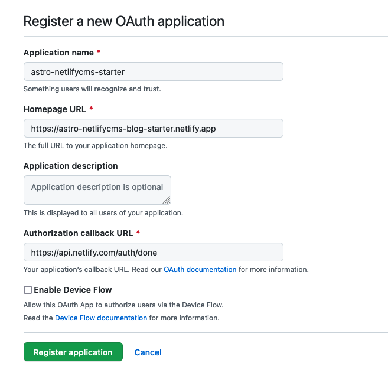

# Astro NetlifyCMS template
This project is a simple blog built with [Astro](https://astro.build/) and [Netlify CMS](https://www.netlifycms.org/).
Astro has a built-in feature that can generate pages (in this case for blog posts) from Markdown files.
Netlify CMS gives you an easy-to-use Content Management System, that can manage data (like blog posts) and multimedia (images / videos) with a nice user interface. The data is stored in Markdown files in your repository, and the multimedia files are uploaded to your repository as well. 
We just have to connect these two, so that Astro can receive the files created by the CMS. **This is what this project does for you.**

You can fork this repository (or use it [as a template](https://docs.github.com/en/repositories/creating-and-managing-repositories/creating-a-repository-from-a-template#creating-a-repository-from-a-template)) and you get a very simple skeleton of a blog that you can customize and make pretty with the frontend tools of your choice. Go make something great! 😁🚀

## Setup
1. Copy this repository (Fork it / [Use as template](https://docs.github.com/en/repositories/creating-and-managing-repositories/creating-a-repository-from-a-template#creating-a-repository-from-a-template) / Download as ZIP ).
	
	(You should install the dependencies with `npm install`, and run the project in dev mode with `npm run dev`)
2. Open the `public/admin/config.yml` file, and replace the `repo` value with your repository’s name.
3. Now head to [Netlify](https://app.netlify.com/).
4. Import your repo from GitHub, and let it build.
5. In a new tab, go to [this shortcut](https://github.com/settings/developers) to create a new OAuth application.
6. Create a new OAuth Application, and fill the details like so:
	 
   
	You should replace the app name and Homepage URL based on your Netlify project.
7. Copy your Client ID and generate a Client secret.
	You should copy these details to a txt file or note. We’ll need them later.
8. Go back to your Netlify tab, and in your project settings go to **`Site settings > Access control > OAuth`**.
9. Install a new provider. Select **Github**, and paste your Client ID and Client secret.

Now you can open your site, and go to the `/admin` page. Here, click on _Sign in with Github_. 

> It will probably ask you to authorize Netlify, you can accept it, then go back to your site.

This is the CMS. You can create, update, or delete posts.

### But what happens in the background?
When you create a new post, it will create a new Markdown file in the `src/pages/blog/posts` folder of your repo. 
Since the repo changed, Netlify will automatically redeploy your page, and you’ll see your blog post in a few minutes. 

The same happens when you upload a photo/video in the CMS, but then it will be saved into the `/public/uploads` folder.

## Customizing Netlify CMS
You can find more details in the [official Netlify CMS docs](https://www.netlifycms.org/docs/configuration-options/).
